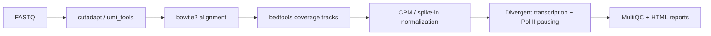

# TrackTx — Nascent RNA Analysis Pipeline

<div align="center">

**A Nextflow pipeline for PRO-seq and nascent RNA-seq analysis**

[](https://github.com/SerhatAktay/TrackTx/actions/workflows/ci.yml)
[](https://www.nextflow.io/)
[](https://www.docker.com/)
[](https://conda.io/)
[](https://opensource.org/licenses/MIT)
[](https://github.com/serhataktay/tracktx/releases/tag/v1.3.0)

</div>

---

## Introduction

TrackTx analyzes nascent RNA sequencing data (PRO-seq, GRO-seq) to measure real-time transcription: where RNA polymerase is engaged, how it pauses, and where transcription initiates divergently.

**Pipeline summary:**

1. Trim and quality-filter reads ([cutadapt](https://cutadapt.readthedocs.io/), [umi_tools](https://umi-tools.readthedocs.io/))
2. Align to the reference and spike-in genome ([bowtie2](https://bowtie-bio.sourceforge.net/bowtie2/))
3. Generate strand-specific coverage tracks ([bedtools](https://bedtools.readthedocs.io/), bedGraphToBigWig)
4. Normalize to CPM and spike-in CPM
5. Detect divergent transcription (Gaussian Mixture Model, FDR control)
6. Assign signal to functional genomic regions and compute Pol II pausing indices
7. QC and report, per-sample and cohort-wide ([MultiQC](https://multiqc.info/), [deepTools](https://deeptools.readthedocs.io/))


```mermaid
graph LR
    A[FASTQ] --> B[cutadapt / umi_tools]
    B --> C[bowtie2 alignment]
    C --> D[bedtools coverage tracks]
    D --> E[CPM / spike-in normalization]
    E --> F[Divergent transcription + Pol II pausing]
    F --> G[MultiQC + HTML reports]
```

One command takes raw reads to publication-ready outputs. It handles single- and paired-end data, PRO-seq and GRO-seq, UMIs, barcodes, and spike-in normalization, and runs the same way on a laptop, a workstation, or an HPC cluster.

Every track set comes in two flavors: `main` (best alignment per read, for quantitative analysis) and `allMap` (every reported alignment, for spotting signal in repetitive regions), split by the `NH` tag.

---

## Contents

- [Quick Start](#quick-start)
- [Testing the Pipeline](#testing-the-pipeline)
- [Pipeline Modules](#pipeline-modules)
- [Installation](#installation)
- [Input Files](#input-files)
- [Outputs](#outputs)
- [Common Use Cases](#common-use-cases)
- [Execution Profiles](#execution-profiles)
- [Performance Optimization](#performance-optimization)
- [Troubleshooting](#troubleshooting)
- [Documentation](#documentation)
- [Citation](#citation)
- [Credits](#credits)
- [License](#license)

---

## Quick Start

### Step 1: Generate Configuration (Interactive, Recommended)

Open the **TrackTx configuration generator** in your browser:

```bash
open TrackTx_config_generator.html   # macOS
# Or double-click the file on any system
```

- Fill in your study details
- For local FASTQ files: enter the **full path** to each file (copy from your file manager → right-click → Copy path)
- Click **Download ZIP** to save `params.yaml` and `samplesheet.csv`
- **Put both files in the same folder as the pipeline** (the tracktx directory where `main.nf` lives)

### Step 2: Run Pipeline (Automatic)

Use the **smart launcher** that auto-detects your environment:

```bash
./run_pipeline.sh
```

The script will:
- Auto-detect Docker, Conda, or local environment
- Load your `params.yaml` and `samplesheet.csv`
- Optimize resource allocation for your system
- Start the pipeline

**Advanced options:**
```bash
./run_pipeline.sh --help                 # See all options
./run_pipeline.sh                       # All files in project dir
./run_pipeline.sh -profile docker        # Force specific profile
./run_pipeline.sh --resume               # Resume previous run
./run_pipeline.sh --output_dir my_run    # Custom output directory
```

**All files in project dir by default.** Use `--external-drive` only when project is on exFAT/USB — then cache, temp, and work (~10–50 GB) go to local; results stay on project.

### Step 3: Monitor Progress (Real-time)

```bash
python3 nfmon.py --from-start --tail 80
```

Live progress bar, per-task runtimes, and tailed module logs, read from the Nextflow trace. Full reference: [docs/MONITORING.md](docs/MONITORING.md)

---

## Testing the Pipeline

The bundled test setup (readymade samplesheets, params, and a download script for small test datasets) verifies the pipeline works before you run your own data.

### Step 1: Download test data (PE only)

Run the download script to fetch and subset public PRO-seq data (~10% of reads, ~100–200 MB for the test):

```bash
# Paired-end (1 sample, ~3 min)
./scripts/download_and_subset_test_data.sh
```

**With Docker** (same image as the pipeline; no local curl/gzip needed):

```bash
./scripts/download_and_subset_test_data.sh --docker
```

The script downloads from ENA, subsets to 10%, and removes the full files. Outputs go to `test_PE/test_data/`.

### Step 2: Run the pipeline with the readymade config

```bash
./run_pipeline.sh \
  --samplesheet test_PE/samplesheet_PE.csv \
  --params-file test_PE/params_PE.yaml \
  --output_dir ./results_test_PE
```

The config uses `sample_source: "local"` and points to the subset FASTQs. See `test_PE/README.md` for dataset details.

---

## Pipeline Modules

TrackTx runs 17 modules in sequence, from genome annotation download through alignment, coverage tracks, normalization, divergent transcription detection, Pol II pausing metrics, QC, and per-sample and cohort reports.

Full description of each module: [docs/MODULES.md](docs/MODULES.md)

---

## Installation

> **Why one container for every step?** TrackTx ships a single Docker image / conda
> environment (`envs/Dockerfile`, `envs/tracktx.yaml`) covering all 17 pipeline stages,
> rather than nf-core's convention of one container per tool. This is deliberate: every
> run of a given TrackTx version uses the exact same toolchain end to end, so citing one
> image tag (or conda lockfile) in a paper's Methods section fully specifies every tool
> version used, with no per-process container matrix to reconcile. The tradeoff is that
> adding or upgrading one tool rebuilds the whole image, which is fine for a pipeline
> with a fixed, curated toolchain rather than one that composes many independently
> versioned community modules.

You need **Nextflow** (≥26.04.0) plus **one** of Docker or Conda for the tools:

```bash
git clone https://github.com/serhataktay/tracktx.git
cd tracktx
./run_pipeline.sh
```

`run_pipeline.sh` auto-detects Docker, Conda, or a local toolchain and runs the pipeline. First run downloads the container image or builds the conda environment.

Full instructions (installing Nextflow, Windows/WSL, Docker/Conda/manual setup, system requirements) are in [docs/INSTALLATION.md](docs/INSTALLATION.md).

---

## Input Files

### Sample Sheet (`samplesheet.csv`)

Use the [config generator](TrackTx_config_generator.html) to create this, or format manually:

```csv
sample,condition,timepoint,replicate,file1,file2
ctrl_rep1,control,0,1,data/ctrl_R1.fastq,data/ctrl_R2.fastq
heat_rep1,treatment,30,1,data/heat_R1.fastq,data/heat_R2.fastq
```

**Single-end:** Use `file1` only; `file2` can be empty.

**For SRR downloads:** Put the SRR accession in `file1`:
```csv
sample,condition,timepoint,replicate,file1,file2
sample1,control,0,1,SRR123456,
```

**Local files:** Use absolute paths (e.g. `/Users/you/data/sample_R1.fastq.gz`) or paths relative to the project directory.

### Parameters (`params.yaml`)

**Generate this with the interactive generator** [`TrackTx_config_generator.html`](TrackTx_config_generator.html) — it writes a validated `params.yaml` with sensible, species-aware defaults for the dozens of advanced options (divergent calibration, functional-region windows, pausing geometry) so you don't have to hand-maintain them.

The generator is the single source of truth for the full schema. The handful of fields you're most likely to set are:

```yaml
# Core
sample_source:   local      # "local" for FASTQ paths, "srr" for SRA accessions
reference_genome: hs1        # hg38, hs1 (T2T), mm39, mm10, dm6, ...
spikein_genome:   dm6        # optional; enables siCPM normalization
paired_end:       true
library_type:     proseq     # proseq (RC R1, 3' signal) | groseq (no RC, 5' signal)
output_dir:       ./results

# Read structure (match your library prep)
barcode: { enabled: true, length: 7, location: 5 }   # 5' random barcode, stripped pre-alignment
umi:     { enabled: true, length: 7, location: 3 }    # UMI for duplicate removal

# Alignment / multimapping
align: { multimap_k: 4 }     # report up to N alignments/read for allMap tracks; 1 = single-best
```

For a complete, always-current worked example see [`test_PE/params_PE.yaml`](test_PE/params_PE.yaml). Every other key (`advanced.*` for divergent transcription, `functional_regions.*`, `pol.*` for pausing and differential contrasts, `qc.*`, `norm.*`, output toggles) has a documented default in `nextflow.config` and is filled in by the generator.

> **Differential pausing contrasts** are configured under `pol.contrasts` (a list of `[condA, tpA, condB, tpB]` comparisons). The generator does not yet emit these — add them by hand to `params.yaml` if you want module 12's treatment-vs-baseline tables. See `test_PE/params_PE.yaml` / the working `params.yaml` for the format.

---

## Outputs

```
results/
├── 05_normalized_tracks/          # Load in IGV/UCSC Browser
│   └── <sample>/3p/*.cpm.bw        # CPM and siCPM normalized BigWigs
├── 06_divergent_tx/               # Divergent transcription (statistical)
│   └── <sample>/
│       ├── divergent_transcription.bed   # High-confidence regions (BED5)
│       └── divergent_transcription_qc.txt # Statistical QC report
├── 07_functional_regions/         # Genomic region annotations
│   └── <sample>/
│       ├── functional_regions.bed
│       └── functional_regions_summary.tsv
├── 08_pol_metrics/                # Pol-II pausing & density
│   └── <sample>/
│       ├── pausing_index.tsv
│       └── pol_density.tsv
├── 10_qc/                         # Quality control metrics
│   └── <sample>/qc_pol.json
├── 11_reports/                    # Interactive HTML reports
│   ├── cohort/
│   │   └── global_summary.html     # Comprehensive cohort dashboard
│   └── samples/
│       └── <sample>/<sample>.report.html
└── trace/                         # Pipeline performance (in output_dir)
    ├── report.html
    ├── timeline.html
    └── trace.txt
```

**Note:** Intermediate outputs (00_references, 01_trimmed_fastq, 02_alignments, 03_genome_tracks, 04_counts, 09_pol_aggregate) are also produced. Trace files live in `{output_dir}/trace/`.

**`main` vs `allMap` tracks:** every track set is emitted twice — `main` (best alignment per read; use for quantitative analysis and as the default browser track) and `allMap` (every reported alignment when `align.multimap_k > 1`; use to inspect signal across repeat copies). With `align.multimap_k: 1` the two are identical.

**Start Here:**
1. **`11_reports/cohort/global_summary.html`** - Comprehensive cohort analysis with:
   - Quality control assessment and outlier detection
   - Mapping uniqueness method and multimapper % per sample
   - Divergent transcription patterns across conditions
   - Pol II pausing index distributions
   - Functional region composition analysis
   - Normalization factor validation
   - Interactive sample metrics table
   
2. **`11_reports/samples/<sample>/<sample>.report.html`** - Detailed per-sample reports

3. **`05_normalized_tracks/<sample>/3p/*.cpm.bw`** - Load directly in IGV/UCSC genome browsers

4. **`trace/report.html`** - Pipeline performance and resource usage

---

## Common Use Cases

### Time-Course Heat Shock

```bash
# Create sample sheet (or use config generator)
cat > timecourse.csv << EOF
sample,condition,timepoint,replicate,file1,file2
t0_r1,control,0,1,data/t0_r1.fastq,
t0_r2,control,0,2,data/t0_r2.fastq,
t30_r1,heat,30,1,data/t30_r1.fastq,
t30_r2,heat,30,2,data/t30_r2.fastq,
EOF

./run_pipeline.sh --samplesheet timecourse.csv
```

### Drug Treatment with Spike-in

```yaml
# params.yaml
reference_genome: "mm39"
spikein_genome: "dm6"
paired_end: false
```

```bash
./run_pipeline.sh --params-file params.yaml
```

### Download from SRA

**Samplesheet** (SRR accessions in `file1`):
```csv
sample,condition,timepoint,replicate,file1,file2
sample1,control,0,1,SRR4454567,
sample2,treatment,30,1,SRR4454568,
```

**params.yaml** must include `sample_source: srr`:
```yaml
sample_source: srr
reference_genome: "hg38"
output_dir: "./results"
```

```bash
./run_pipeline.sh --samplesheet sra_samples.csv --params-file params.yaml
```

---

## Execution Profiles

The pipeline **auto-detects** your environment, but you can force a specific profile:

| Profile | Description | Use When |
|---------|-------------|----------|
| **docker** | Everything included (recommended) | Docker is available |
| **conda** | Auto environment setup | Docker not available |
| **conda_server** | For NFS/network storage | Conda has filesystem issues |
| **singularity** | HPC containers | On HPC clusters |
| **slurm** | SLURM scheduler | Combine with containers |
| **performance** | External drive optimizations | Use with docker/conda via `--external-drive` |
| **local** | System tools | Tools already installed |

**Examples:**
```bash
./run_pipeline.sh                          # Auto-detect
./run_pipeline.sh -profile docker          # Force Docker
./run_pipeline.sh -profile conda           # Force Conda
./run_pipeline.sh -profile slurm,singularity  # HPC with Singularity
./run_pipeline.sh --external-drive         # USB/exFAT: appends performance profile
```

---

## Performance Optimization

### Pipeline Too Slow? Try These Fixes

**Problem**: Pipeline running from USB/exFAT/NAS, or getting "Failed to publish file [link]" errors?

**Solution**: Use **external drive mode** for correct behavior:

```bash
./run_pipeline.sh --external-drive
```

This automatically:
- Keeps **results** on your project directory (no local space needed for outputs)
- Fixes publish errors (uses copy instead of hard links)
- Fixes OverlappingFileLockException (cache, temp, work on local — exFAT lacks file locking)
- Disables scratch space (reduces file copying on slow storage)
- Increases task parallelism for better I/O utilization

**Note:** `--external-drive` puts cache, temp, and work (~10–50 GB) on local disk (`~/tmp/tracktx_*`); only results stay on the project dir. Ensure ~20–50 GB free on your internal drive.

### Storage Footprint

Typical sizes for a single-sample PE test run (10% subset):

| Location | Size | Contents |
|----------|------|----------|
| **results/** | ~2.3 GB | Published outputs |
| **work/** | ~1.7 GB | Nextflow intermediates (BAMs, bedgraphs, logs) |
| **.cache/genomes** | ~7 GB | Reference genomes (shared across runs) |
| **input data** | ~325 MB | Raw FASTQ (test subset) |

**Largest result folders:** `01_trimmed_fastq` (~920 MB uncompressed FASTQ), `00_references` (~800 MB, mostly GTF), `02_alignments` (~270 MB), `03_genome_tracks` (~150 MB), `05_normalized_tracks` (~165 MB).

**Ways to reduce footprint:**

1. **Skip trimmed FASTQ** — `publish_trimmed_fastq: false` (~920 MB per sample)
2. **Skip alignments** — `publish_alignments: false` (~270 MB per sample)
3. **Skip GTF** — `publish_references_gtf: false` (~790 MB one-time)
4. **Skip raw tracks** — `output.raw_tracks: false` (~150 MB; normalized tracks kept)
5. **Skip bedGraphs** — `output.bedgraph: false` (~100 MB; BigWigs kept)
6. **Skip allMap tracks** — `norm.emit_allmap: false` (~50 MB)
7. **Skip 5′ tracks** — `norm.emit_5p: false` (~75 MB; 3′ always kept)
8. **Shared genome cache** — Point `genome_cache` to a central location
9. **Clean work dir** — `nextflow clean -f` after a successful run

### Expected Performance

| Sample Count | Optimized (Internal SSD) | Default (External SSD) |
|--------------|-------------------------|------------------------|
| 2 samples    | 30-60 min               | 2-3 hours              |
| 4 samples    | 1-2 hours               | 4-6 hours              |
| 8 samples    | 2-4 hours               | 8-12 hours             |

## Troubleshooting

When a process fails, Nextflow prints the captured output. Look for the TRACKTX ERROR block; it names the problem and the fix:

```
═══════════════════════════════════════════════════════════════════════
TRACKTX ERROR
═══════════════════════════════════════════════════════════════════════
Module:  detect_divergent_transcription
Problem: Missing Python dependencies (numpy, pandas, scikit-learn, scipy)
Fix:     pip install numpy pandas scikit-learn scipy | Or use: -profile conda | -profile docker
═══════════════════════════════════════════════════════════════════════
```

Full log is in the work dir (shown at the end of the error). Add `-resume` to continue after fixing the issue.

Fixes for out-of-memory errors, exFAT/USB publish and file-lock failures, conda/Docker issues, stuck matplotlib font cache, unresumed runs, and more: [docs/TROUBLESHOOTING.md](docs/TROUBLESHOOTING.md)

**Getting help:** `.nextflow.log` (run directory), `{output_dir}/trace/report.html` (resource issues), `python3 nfmon.py` (live monitor), or [open a GitHub issue](https://github.com/serhataktay/tracktx/issues).

---

## Documentation

| Document | Description |
|----------|-------------|
| [TrackTx_config_generator.html](TrackTx_config_generator.html) | Interactive config and samplesheet generator |
| [docs/INSTALLATION.md](docs/INSTALLATION.md) | Full install instructions (Docker, Conda, manual, Windows/WSL, system requirements) |
| [docs/MODULES.md](docs/MODULES.md) | What each of the 17 pipeline modules does |
| [docs/TROUBLESHOOTING.md](docs/TROUBLESHOOTING.md) | Errors, fixes, and where to look when something breaks |
| [docs/MONITORING.md](docs/MONITORING.md) | nfmon live-monitor reference (header fields, options) |

---

## Citation

If TrackTx is useful for your research, please cite: [https://github.com/serhataktay/tracktx](https://github.com/serhataktay/tracktx)

### Key References
- **PRO-seq**: [Kwak et al., 2013](https://doi.org/10.1126/science.1229386) - Precision run-on sequencing
- **Nascent RNA-seq**: [Core et al., 2008](https://doi.org/10.1126/science.1162228) - Global nascent transcription
- **Nextflow**: [Di Tommaso et al., 2017](https://doi.org/10.1038/nbt.3820) - Scalable workflows

---

## Credits

TrackTx is developed and maintained by [Serhat Aktay](https://github.com/SerhatAktay).

Bug reports and feature requests: [GitHub Issues](https://github.com/serhataktay/tracktx/issues)

---

## License

TrackTx is released under the [MIT License](LICENSE).
