# TrackTx-NF: Nascent RNA Analysis Pipeline

<div align="center">

**🧬 A powerful, user-friendly Nextflow pipeline for analyzing nascent RNA sequencing data**

[](https://www.nextflow.io/)
[](https://www.docker.com/)
[](https://conda.io/)
[](https://opensource.org/licenses/MIT)

[**Quick Start**](#-quick-start) •
[**Features**](#-features) •
[**Installation**](#️-installation) •
[**Usage**](#-usage) •
[**Documentation**](#-documentation)

</div>

---

## 🚀 Quick Start

Get up and running in **under 5 minutes**:

### 1. **Install Docker** (2 minutes)
```bash
# Download Docker Desktop: https://docs.docker.com/get-docker/
# Or use your system package manager
```

### 📡 Live Monitoring (nf-monitor)

TrackTx ships with a terminal UI monitor for live, per-task insight during runs.

```bash
# In the pipeline working directory (where .nextflow.log is produced)
python3 nfmon.py \
  --log .nextflow.log \
  --trace results/trace/trace.txt \
  --refresh 0.8

# Minimal mode if you only have the trace file
python3 nfmon.py --trace results/trace/trace.txt --from-start

# One-shot summary (prints a snapshot and exits)
python3 nfmon.py --trace results/trace/trace.txt --oneshot

# Export JSON snapshot to a file (updates atomically)
python3 nfmon.py --trace results/trace/trace.txt --oneshot --json nfmon.json
```

What you get:
- Live list of running tasks with PID, CPU%, memory (RSS), age, and stage hints
- Total pipeline progress, cumulative completed/failed/cached counts
- Live log tail for the focused task (or all running tasks with `--all-logs`)
- System stats (CPU/MEM/LOAD), approximate cores-in-use

Useful flags:
- `--filter "<regex>"`: show only processes matching a name pattern
- `--all-logs`: stack live logs of all running tasks in the UI
- `--log-rows N`: preferred height for the live log panel in the Rich UI
- `--retain-sec N`: keep finished tasks visible for N seconds (0 = clear immediately)
- `--from-start`: ingest full history instead of tailing current run only

Keyboard hints (Rich/curses UI):
- j/k: move focus • f: filter by process • s: sort • +/- and ]/[ : log/tail size • a: toggle all-logs • q: quit

### 2. **Clone & Prepare** (1 minute)
```bash
git clone https://github.com/SerhatAktay/TrackTx.git
cd TrackTx
# Generate config & sample sheet using the built-in generator
# 1) Open the generator in your browser
open TrackTx_config_generator.html   # macOS (or double-click the file)
# 2) Fill in your study details
# 3) Click Export to save: params.yaml and samplesheet.csv
```

### 3. **Run Pipeline** (30 seconds to start)
```bash
./run_pipeline.sh --params-file params.yaml --samplesheet samplesheet.csv
# 🎉 That's it! The pipeline uses your generated inputs and handles the rest
```

### 4. **View Results**
```bash
# Open the cohort summary
open results/global_summary.html

# Browse per-sample reports
open results/11_reports/cohort/global_summary.html
open results/reports/<SAMPLE_ID>.html   # per-sample shortcut links

# Load tracks in genome browser (BigWigs)
ls results/05_normalized_tracks/*/*/cpm/*.bw
```

---

## 🧬 What is TrackTx-NF?

TrackTx-NF analyzes **nascent RNA sequencing data** to understand real-time gene transcription dynamics. Unlike traditional RNA-seq that captures steady-state RNA levels, nascent RNA-seq captures newly synthesized RNA, providing insights into active transcription processes.

### 🔬 Scientific Applications

Perfect for studying:
- **🔥 Heat shock responses** and stress biology
- **💊 Drug treatments** and compound screening  
- **⏱️ Transcription kinetics** and gene regulation
- **🧬 RNA Polymerase II** behavior and pausing
- **🔄 Divergent transcription** from promoters
- **🧪 Developmental transitions** and cell fate

### 📊 Analysis Workflow

```mermaid
graph LR
    A[📁 FASTQ Files] --> B[✂️ Read Processing]
    B --> C[🧭 Genome Alignment]
    C --> D[📈 Track Generation]
    D --> E[🔄 Divergent Detection]
    E --> F[⚖️ Normalization]
    F --> G[📊 Interactive Reports]
```



1. **📁 Read Processing** → Adapter trimming, UMI/barcode handling, quality control
2. **🧭 Genome Alignment** → Optimized Bowtie2 mapping with spike-in support
3. **📈 Track Generation** → Strand-specific coverage tracks (bedGraph/BigWig)
4. **🔄 Divergent Detection** → Identifies bidirectional transcription events
5. **⚖️ Normalization** → CPM and spike-in normalization for quantitative comparisons
6. **📊 Interactive Reports** → Professional HTML dashboards with advanced visualizations

---

## ✨ Features

### 🔧 **Universal Compatibility**
- **🖥️ Any System**: Laptops, workstations, servers, HPC clusters, cloud
- **⚡ Smart Scaling**: Automatically adapts from 1-CPU to 100+ CPU systems
- **🐳 Container-Ready**: All software included via Docker - no installation hassles
- **🐍 Conda Support**: Automatic environment setup when Docker unavailable
- **☁️ Cloud-Native**: AWS, Google Cloud, Azure compatible

### 🎛️ **Intelligent Operation**
- **🤖 Auto-Detection**: Automatically detects and optimizes for your environment
- **📊 Adaptive Resources**: Optimizes CPU/memory allocation based on system capabilities
- **🎯 Smart Defaults**: Works immediately with sensible parameters
- **🔧 Easy Customization**: Simple YAML configuration for advanced users
- **🔄 Resume Support**: Intelligent checkpoint/resume for long-running analyses

### 📈 **Advanced Analysis**
- **🧪 Flexible Input**: Single-end and paired-end sequencing data
- **🧬 Multi-Genome**: Human (hs1), mouse (mm39), fly (dm6), plant genomes, custom references
- **🏷️ UMI/Barcode Support**: Molecular identifiers and sample demultiplexing
- **📏 Spike-in Normalization**: Quantitative cross-sample comparisons using external controls
- **📊 Rich Visualizations**: Interactive plots, heatmaps, and genome browser tracks
- **📋 Comprehensive QC**: Detailed quality control metrics and validation

---

## 🏗️ Installation

> **💡 No Sudo/Admin Access?** This pipeline works perfectly without root privileges!  
> Just needs: Nextflow + Conda (both installable to your home directory, no admin required).

### **Option 1: Docker** (Recommended)
```bash
# 1. Install Docker Desktop
# https://docs.docker.com/get-docker/

# 2. Clone and run
git clone https://github.com/SerhatAktay/TrackTx.git
cd TrackTx
# Generate params.yaml & samplesheet.csv via TrackTx_config_generator.html, then:
./run_pipeline.sh --params-file params.yaml --samplesheet samplesheet.csv
```

### **Option 2: Conda** (No sudo required)
```bash
# 1. Install Miniconda (to your home directory - no sudo needed)
# https://docs.conda.io/en/latest/miniconda.html

# 2. Clone and run
git clone https://github.com/SerhatAktay/TrackTx.git
cd TrackTx
# Generate params.yaml & samplesheet.csv via TrackTx_config_generator.html, then:
./run_pipeline.sh --params-file params.yaml --samplesheet samplesheet.csv
```

**Note:** The conda profile also works with mamba/micromamba if you have them installed (faster solving).

### **Option 3: Manual Installation**
```bash
# Install dependencies (see envs/tracktx.yaml for full list):
# - nextflow (≥25.04.0)
# - bowtie2, samtools, bedtools, bedGraphToBigWig
# - python3, umi_tools, cutadapt, fastqc

git clone https://github.com/SerhatAktay/TrackTx.git
cd TrackTx
./run_pipeline.sh -profile local
```

---

## 🚀 Usage

### **Basic Usage**
```bash
# Default analysis (auto-detects environment)
# Recommended: explicitly provide your generated files
./run_pipeline.sh --params-file params.yaml --samplesheet samplesheet.csv

# With custom sample sheet
./run_pipeline.sh --samplesheet my_samples.csv

# With custom parameters
./run_pipeline.sh --params-file my_params.yaml

# Resume interrupted run
./run_pipeline.sh --resume

# Preview commands without running
./run_pipeline.sh --dry-run
```

### **Input Files**

#### **Sample Sheet** (`samplesheet.csv`)
```csv
sample_id,condition,timepoint,replicate,file
ctrl_rep1,control,0,1,data/ctrl_rep1.fastq
ctrl_rep2,control,0,2,data/ctrl_rep2.fastq
heat_rep1,treatment,30,1,data/heat_rep1.fastq
heat_rep2,treatment,30,2,data/heat_rep2.fastq
```

### QC options (fastp default)

You can choose which QC tool to run during input preparation and whether to QC raw inputs in addition to final reads.

```yaml
# params.yaml
qc:
  tool: fastp   # fastp | fastqc | none
fastqc_raw: true # also QC raw inputs (respects qc.tool)
```

- fastp (default): faster, single-pass QC with modern HTML and machine-readable JSON.
- fastqc: classic FastQC modules; slower. The pipeline prints a warning about speed.
- none: skip QC entirely (the pipeline writes small README notes under `fastqc_raw/` and `fastqc_final/`).

Outputs under `01_trimmed_fastq/<sample>/`:
- If `qc.tool: fastp`:
  - `fastqc_raw/fastp_raw.{html,json}` when `fastqc_raw: true`
  - `fastqc_final/fastp_final.{html,json}` always (unless `qc.tool: none`)
- If `qc.tool: fastqc`:
  - FastQC HTML/zip in the same `fastqc_*` directories.

Fastp vs FastQC (at-a-glance):
- fastp: per-base quality/content, GC, duplication, adapter content (detect/detect_adapter_for_pe), length dist, overrepresented sequences, N content, polyX tails; multithreaded; HTML + JSON.
- FastQC: per-base/per-sequence quality and GC, length dist, duplication, overrepresented sequences, adapter content, k-mer content, per-tile quality; HTML + data zip; slower.

#### **Parameters** (`params.yaml`) - Typically generated
```yaml
# Basic settings
reference_genome: "hs1"      # Human (hs1), Mouse (mm39), Fly (dm6)
paired_end: false           # true for paired-end data
output_dir: "./results"

# Advanced options
adapter_trim:
  enabled: true
  adapter1: "TGGAATTCTCGGGTGCCAAGG"
umi:
  enabled: true
  length: 7
spike_in:
  enabled: true
  genome: "dm6"
divergent_tx:
  enabled: true
  threshold: 1.0
```

### **Example Workflows**

#### **Time-Course Heat Shock Study**
```bash
# Create time course sample sheet
cat > timecourse.csv << EOF
sample_id,condition,timepoint,replicate,file
t0_r1,baseline,0,1,data/timepoint_0_rep1.fastq
t0_r2,baseline,0,2,data/timepoint_0_rep2.fastq
t15_r1,heat_shock,15,1,data/timepoint_15_rep1.fastq
t15_r2,heat_shock,15,2,data/timepoint_15_rep2.fastq
t30_r1,heat_shock,30,1,data/timepoint_30_rep1.fastq
t30_r2,heat_shock,30,2,data/timepoint_30_rep2.fastq
t60_r1,heat_shock,60,1,data/timepoint_60_rep1.fastq
t60_r2,heat_shock,60,2,data/timepoint_60_rep2.fastq
EOF

./run_pipeline.sh --samplesheet timecourse.csv
```

#### **Drug Treatment with Spike-in**
```bash
cat > drug_params.yaml << EOF
reference_genome: "mm39"
spike_in:
  enabled: true
  genome: "dm6"
adapter_trim:
  adapter1: "AGATCGGAAGAGC"
EOF

./run_pipeline.sh --params-file drug_params.yaml
```

#### **Paired-End PRO-seq Analysis**
```bash
cat > proseq_params.yaml << EOF
paired_end: true
umi:
  enabled: false
adapter_trim:
  enabled: true
  adapter1: "TGGAATTCTCGGGTGCCAAGG"
  adapter2: "AGATCGGAAGAGCGGTTCAG"
EOF

./run_pipeline.sh --params-file proseq_params.yaml
```

---

## 📊 Outputs

### **Directory Structure**
```
results/
├── 📄 index.html                       # Landing page with quick links
├── 📊 global_summary.html              # Cohort dashboard (copy of 11_reports/cohort)
├── 📈 03_genome_tracks/                # RAW coverage bedGraphs (and BigWigs if enabled)
│   └── <sample_id>/...
├── ⚖️ 05_normalized_tracks/            # Quantitative comparison tracks
│   └── <sample_id>/
│       └── 3p/
│           ├── main/cpm/{pos,neg}.bw
│           └── allMap/cpm/{pos,neg}.bw
├── 🔄 06_divergent_tx/                 # Divergent transcription analysis
│   ├── sample1_divergent_regions.bed  # Detected divergent regions
│   └── divergent_summary.tsv          # Summary statistics
├── 🧬 07_functional_regions/          # Functional genomic region assignment
│   ├── functional_regions.bed         # Annotated regions (BED9)
│   └── functional_regions_summary.tsv # Per-category signal totals
├── 📊 08_pol2_metrics/                # Pol II metrics and pausing index
├── 📋 10_qc/                          # Quality control metrics
│   ├── qc_strand_bias.tsv            # Strand distribution
│   ├── qc_pol2.json                  # Comprehensive QC metrics
│   └── qc_coverage.tsv               # Coverage statistics
├── 📋 04_counts/                      # Read count summaries
└── 🗂️ 11_reports/
    ├── cohort/{global_summary.html, .tsv, .json}
    └── samples/<sample_id>/{<sample_id>.report.html, .tsv, .json}
```

### **Key Output Files**

| File | Description |
|------|-------------|
| **`global_summary.html`** | 🎯 Cohort dashboard with per-sample drilldowns |
| **`11_reports/samples/<sid>/*.report.html`** | 📊 Individual sample reports |
| **`05_normalized_tracks/*/*/cpm/*.bw`** | 📈 Load directly in IGV, UCSC Genome Browser, or WashU |
| **`05_normalized_tracks/`** | ⚖️ Quantitative tracks for cross-sample comparisons |
| **`06_divergent_tx/*.bed`** | 🔄 Divergent transcription regions and summit coordinates |
| **`trace/report.html` (under `results/trace/`)** | 📊 Nextflow performance report |

---

## 🔧 Configuration Profiles

The pipeline automatically detects your environment, but you can specify profiles manually:

| Profile | Description | When to Use |
|---------|-------------|-------------|
| **`docker`** 🐳 | Everything included, fastest | **Recommended** - Most reliable |
| **`conda`** 🐍 | Auto environment setup | When Docker unavailable (works with conda/mamba/micromamba) |
| **`local`** 🖥️ | System-installed tools | Manual tool management |

```bash
./run_pipeline.sh                 # Auto-detect environment
./run_pipeline.sh -profile docker # Force Docker
./run_pipeline.sh -profile conda  # Force Conda
```

---

## 📋 Requirements

### **System Requirements**

| Component | Minimum | Recommended |
|-----------|---------|-------------|
| **OS** | Linux, macOS, Windows (WSL2) | Linux or macOS |
| **CPU** | 1+ cores | 8+ cores |
| **RAM** | 4+ GB | 16+ GB |
| **Storage** | 50+ GB free | 200+ GB SSD |
| **Software** | Docker OR Conda | Docker Desktop |

### **Pipeline automatically scales** from single-CPU laptops to high-end servers!

---

## 🚀 Performance & Scaling

### **Automatic Resource Optimization**

The pipeline intelligently adapts to your system:

| System Type | CPU Usage | Memory | Typical Runtime* |
|-------------|-----------|--------|------------------|
| **Laptop** (4 cores, 8GB) | 1-4 CPUs | 2-6 GB | 2-4 hours |
| **Workstation** (12 cores, 32GB) | 2-8 CPUs | 4-16 GB | 1-2 hours |
| **Server** (32+ cores, 64GB+) | 4-8 CPUs | 8-32 GB | <1 hour |

*_For typical dataset (10-20M reads per sample)_

### **Performance Tips**
- 🚀 **Use SSD storage** for dramatic I/O improvements
- 🐳 **Docker profile** provides best performance and reliability
- ⚡ **More CPU cores** = faster alignment and track generation
- 💾 **More RAM** = better caching and reduced disk usage

---

## 🔧 Troubleshooting

### **Common Issues & Solutions**

<details>
<summary><b>❌ "Docker not found" or "Docker daemon not running"</b></summary>

**Solution:**
```bash
# Install Docker Desktop: https://docs.docker.com/get-docker/
# Make sure Docker Desktop is running
# Test: docker --version
```
</details>

<details>
<summary><b>❌ "Sample sheet not found"</b></summary>

**Solution:**
```bash
# Create sample sheet in correct location
echo "sample_id,condition,timepoint,replicate,file" > samplesheet.csv
echo "sample1,control,0,1,data/sample1.fastq" >> samplesheet.csv
```
</details>

<details>
<summary><b>❌ "Out of memory" errors (exit 137)</b></summary>

**Solution:**
```bash
# Pipeline auto-adapts, but for very large datasets:
export NXF_HOST_MEM=32  # Force 32GB memory limit
./run_pipeline.sh

# Or use fewer parallel processes:
export NXF_HOST_CPUS=4  # Limit to 4 CPUs
./run_pipeline.sh
```
</details>

<details>
<summary><b>❌ "Conda environment creation failed"</b></summary>

**Solution:**
```bash
# Use Docker instead (more reliable):
./run_pipeline.sh -profile docker

# Or clean conda cache:
conda clean --all --yes
./run_pipeline.sh
```
</details>

<details>
<summary><b>❌ Pipeline seems very slow</b></summary>

**Reasons & Solutions:**
- **First run**: Downloads reference genomes (normal, ~10-30 min)
- **Large dataset**: Expected for >50M reads per sample
- **Limited resources**: Pipeline adapts but takes longer
- **I/O bottleneck**: Use SSD storage for work directory
</details>

<details>
<summary><b>⚠️ High "Non-localized Polymerase" percentage (>20%)</b></summary>

**Expected**: 5-10% for well-annotated genomes (human, mouse)

**If you see >20%, check:**

1. **Genome assembly mismatch** ← Most common cause
   ```bash
   # Ensure FASTQ data matches reference genome
   # Example: hg38 data requires hg38 reference (not hg19)
   ```

2. **Incomplete annotation**
   ```bash
   # Use comprehensive GTF (e.g., GENCODE comprehensive, not basic)
   # Verify annotation matches genome assembly version
   ```

3. **Sample quality issues**
   ```bash
   # Check duplication rate (<30% expected)
   # Review QC reports in results/10_qc/
   # Look for adapter contamination in FastQC
   ```

4. **Wrong library type**
   - PRO-seq, ChIP-seq: 5-10% expected
   - GRO-seq: 10-15% acceptable
   - Total RNA-seq: NOT appropriate for this pipeline

**See [docs/FUNCTIONAL_REGIONS.md](docs/FUNCTIONAL_REGIONS.md) for detailed troubleshooting.**
</details>

### **Getting Help**
1. 📊 **Check execution report**: `results/execution_report.html`
2. 📋 **Review pipeline logs**: `.nextflow.log`
3. 🔍 **Examine work directories**: `work/*/`
4. 💬 **GitHub Discussions**: [Discussions](https://github.com/SerhatAktay/TrackTx/discussions)
5. 🐛 **Report bugs**: [Issues](https://github.com/SerhatAktay/TrackTx/issues)

---

## 🧬 Scientific Background

### **Nascent RNA-seq vs Traditional RNA-seq**

| Aspect | Traditional RNA-seq | Nascent RNA-seq |
|--------|-------------------|-----------------|
| **RNA Captured** | Steady-state total RNA | Newly synthesized RNA |
| **Time Resolution** | Hours to days | Minutes to hours |
| **Labeling** | None | Metabolic (4sU, 6sU, BrU) |
| **Insights** | Gene expression levels | Real-time transcription rates |

### **Key Experimental Steps**
1. **🧪 Metabolic Labeling**: Cells incorporate modified nucleotides (4sU/6sU/BrU)
2. **⏱️ Time Course**: Sample at multiple time points after stimulus
3. **🧲 RNA Isolation**: Biotin-streptavidin pulldown of labeled RNA
4. **🧬 Library Prep**: Standard RNA-seq library preparation
5. **📊 Analysis**: TrackTx-NF pipeline for comprehensive analysis

### **Applications in Research**
- **🔥 Stress Biology**: Heat shock, oxidative stress, osmotic stress
- **💊 Pharmacology**: Drug mechanism of action, dose-response studies
- **🧪 Development**: Cell fate transitions, differentiation programs
- **🦠 Disease**: Cancer progression, neurodegeneration, inflammation
- **🔬 Basic Biology**: Transcription factor function, chromatin regulation

---

## 📖 Documentation

### **Core Documentation**
- **[FUNCTIONAL_REGIONS.md](docs/FUNCTIONAL_REGIONS.md)** - Detailed guide to functional region classification
  - Hierarchical assignment logic
  - Expected percentage ranges
  - Quality control guidelines
  - Troubleshooting high non-localized readings
  
- **[CPU_ALLOCATION_GUIDE.md](docs/CPU_ALLOCATION_GUIDE.md)** - Performance optimization guide
  - Resource allocation strategies
  - Throughput vs latency tradeoffs
  - System-specific recommendations

<!-- Removed stale reference to BUGFIX_SUMMARY.md; see GitHub Releases for change logs. -->

### **Interactive Tools**
- **[TrackTx_config_generator.html](TrackTx_config_generator.html)** - Web-based configuration generator
  - Point-and-click parameter setup
  - Generates validated `params.yaml`
  - Includes documentation for all options

---

## 📚 Citation & References

### **How to Cite TrackTx-NF**
```bibtex
@software{tracktx_nf,
  title = {TrackTx-NF: A comprehensive Nextflow pipeline for nascent RNA sequencing analysis},
  author = {Serhat Aktay and Contributors},
  year = {2025},
  url = {https://github.com/SerhatAktay/TrackTx},
  doi = {10.5281/zenodo.XXXXXX}  # Will be assigned upon publication
}
```

### **Key References**
- **Nascent RNA-seq methods**: [Core et al., 2008](https://doi.org/10.1126/science.1162228)
- **PRO-seq technique**: [Kwak et al., 2013](https://doi.org/10.1038/nmeth.2478)
- **4sU-seq protocol**: [Rabani et al., 2011](https://doi.org/10.1038/nmeth.1582)
- **Divergent transcription**: [Scruggs et al., 2015](https://doi.org/10.1371/journal.pgen.1005387)

### **Pipeline Components**
- **Nextflow**: [Di Tommaso et al., 2017](https://doi.org/10.1038/nbt.3820)
- **Bowtie2**: [Langmead & Salzberg, 2012](https://doi.org/10.1038/nmeth.1923)
- **bedtools**: [Quinlan & Hall, 2010](https://doi.org/10.1093/bioinformatics/btq033)
- **UMI-tools**: [Smith et al., 2017](https://doi.org/10.1101/gr.209601.116)

---

## 🤝 Contributing

We welcome contributions! Please see our [Contributing Guidelines](CONTRIBUTING.md).

### **Ways to Contribute**
- 🐛 **Report bugs** via [GitHub Issues](https://github.com/SerhatAktay/TrackTx/issues)
- ✨ **Request features** via [GitHub Discussions](https://github.com/SerhatAktay/TrackTx/discussions)
- 📖 **Improve documentation** with pull requests
- 🧪 **Add test datasets** and validation cases
- 🔧 **Contribute code** via pull requests

### **Development Setup**
```bash
git clone https://github.com/SerhatAktay/TrackTx.git
cd TrackTx

# Run tests
./run_pipeline.sh --dry-run

# Contribute your changes
git checkout -b feature-branch
# Make changes...
git commit -m "Add feature X"
git push origin feature-branch
# Open pull request
```

---

## 📜 License

TrackTx-NF is released under the [MIT License](LICENSE).

---

## 🙏 Acknowledgments

- **Nextflow Community** for the amazing workflow framework
- **nf-core** for best practices and inspiration
- **Bioconda** for comprehensive software packaging
- **Docker** for containerization technology
- **All contributors** who make this project better

---

<div align="center">

**🧬 Happy analyzing! TrackTx-NF makes nascent RNA analysis simple, powerful, and reproducible.**

⭐ **Star this repo** if TrackTx-NF is useful for your research!

[**Documentation**](https://github.com/SerhatAktay/TrackTx/wiki) •
[**Discussions**](https://github.com/SerhatAktay/TrackTx/discussions) •
[**Issues**](https://github.com/SerhatAktay/TrackTx/issues) •
[**Releases**](https://github.com/SerhatAktay/TrackTx/releases)

</div>