# TrackTx — Nascent RNA Analysis Pipeline

<div align="center">

**A powerful Nextflow pipeline for PRO-seq and nascent RNA-seq analysis**

[](https://www.nextflow.io/)
[](https://www.docker.com/)
[](https://conda.io/)
[](https://opensource.org/licenses/MIT)
[](https://github.com/serhataktay/tracktx-nf/releases)

</div>

---

## 📚 Contents

- [🎉 What's New in v3.0](#-whats-new-in-v30)
- [⚡ Quick Start](#-quick-start)
- [📊 What Does TrackTx Do?](#-what-does-tracktx-do)
- [🔧 Installation](#-installation)
- [📁 Input Files](#-input-files)
- [📊 Outputs](#-outputs)
- [🎯 Common Use Cases](#-common-use-cases)
- [⚙️ Execution Profiles](#-execution-profiles)
- [⚡ Performance Optimization](#-performance-optimization)
- [🔧 Troubleshooting](#-troubleshooting)
- [📖 Documentation](#-documentation)
- [🧬 Citation](#-citation)
- [📜 License](#-license)

---

## 🎉 What's New in v3.0

### 🔬 Statistical Divergent Transcription Detection
- **Gaussian Mixture Models (GMM)** with FDR control for high-confidence region calling
- **Auto-calibration**: No manual threshold tuning needed - set to `auto` and go!
- **Beta-Binomial models** for robust background estimation
- Replaces threshold-based detection with statistically-driven approach
- Comprehensive QC reports with score distributions

### 📊 Comprehensive Cohort Reporting
- **8 detailed analysis sections** with extensive explanations:
  - Quality Control Analysis with outlier detection
  - Divergent Transcription patterns across conditions
  - Pol II Pausing Index distributions and comparisons
  - Functional Region composition analysis
  - Normalization factor validation
  - Sample-level interactive metrics table
- **Beautiful modern UI** with smooth navigation and responsive design
- **Interactive visualizations** with histograms, distributions, and comparisons
- **By-condition analysis** for all major metrics
- **Replicate consistency checks** (coefficient of variation)

### 🎨 Enhanced Configuration Generator
- **Extensive explanatory text** for every setting
- **More spacious layout** for better readability
- **Logical organization** with related settings grouped together
- **Bold section headers** for easier navigation
- **Inline help** explaining when/why to use each option
- Updated for the latest parameters and best practices

### 🐛 Pipeline Improvements
- Fixed caching issues with divergent detection parameters
- Better handling of UMI and barcode processing
- Improved parameter validation and error messages
- Enhanced documentation throughout

---

## ⚡ Quick Start

Get started in **3 simple steps**:

### 1️⃣ Generate Configuration (Interactive, Recommended)

Open the **TrackTx configuration generator** in your browser:

```bash
open TrackTx_config_generator.html   # macOS
# Or double-click the file on any system
```

- Fill in your study details
- For local FASTQ files: enter the **full path** to each file (copy from your file manager → right-click → Copy path)
- Click **Download ZIP** to save `params.yaml` and `samplesheet.csv`
- Done!

### 2️⃣ Run Pipeline (Automatic)

Use the **smart launcher** that auto-detects your environment:

```bash
./run_pipeline.sh
```

That's it! The script will:
- ✅ Auto-detect Docker, Conda, or local environment
- ✅ Load your `params.yaml` and `samplesheet.csv`
- ✅ Optimize resource allocation for your system
- ✅ Start the pipeline

**Advanced options:**
```bash
./run_pipeline.sh --help                 # See all options
./run_pipeline.sh --fast                 # ⚡ Performance mode (external drives)
./run_pipeline.sh -profile docker        # Force specific profile
./run_pipeline.sh --resume               # Resume previous run
./run_pipeline.sh --output_dir my_run    # Custom output directory
```

**💡 Running from external storage?** Use the `--fast` flag for 2–3× speedup when working from external or slower disks.

### 3️⃣ Monitor Progress (Real-time)

Watch your pipeline in action with the **live monitor**:

```bash
python3 nfmon.py
```

Features:
- 📊 Real-time task progress and resource usage
- 🎯 Live log tailing for active tasks
- 💻 CPU/memory/load monitoring
- ⚡ Per-task performance metrics

**Monitor options:**
```bash
python3 nfmon.py --help                          # All options
python3 nfmon.py --filter "alignment"            # Watch specific tasks
python3 nfmon.py --all-logs                      # See all task logs
python3 nfmon.py --oneshot                       # Quick snapshot
python3 nfmon.py --oneshot --json status.json    # Export JSON
```

---

## 📊 What Does TrackTx Do?

TrackTx analyzes nascent RNA sequencing data (PRO-seq, GRO-seq, etc.) to understand **real-time transcription**:

```mermaid
graph LR
    A[📁 FASTQ Files] --> B[✂️ QC & Trimming]
    B --> C[🧭 Alignment]
    C --> D[📈 Track Generation]
    D --> E[⚖️ Normalization]
    E --> F[🔬 Statistical Detection]
    F --> G[📊 Comprehensive Reports]
```



**Pipeline overview:** See [HOW.md](HOW.md) for a step-by-step description of what happens to your data from raw FASTQ to final reports.

**Key Features:**
- 🎯 **Automated**: From raw reads to publication-ready figures
- 🚀 **Fast**: Optimized for any system (laptop → HPC)
- 📊 **Comprehensive**: Alignment, tracks, divergent transcription, Pol-II metrics
- ⚖️ **Quantitative**: Spike-in normalization for cross-sample comparisons
- 🎨 **Beautiful**: Interactive HTML reports with extensive visualizations
- 🔬 **Statistical**: GMM-based divergent detection with FDR control
- 📈 **Insightful**: Cohort-wide analysis with by-condition comparisons
- 💡 **Guided**: Extensive explanations and quality assessment throughout

---

## 🔧 Installation

### Option 1: Docker (Recommended)

```bash
# Install Docker Desktop: https://docs.docker.com/get-docker/
git clone https://github.com/serhataktay/tracktx-nf.git
cd tracktx-nf
./run_pipeline.sh  # Auto-detects Docker
```

### Option 2: Conda

```bash
# Install Miniconda: https://docs.conda.io/en/latest/miniconda.html
git clone https://github.com/serhataktay/tracktx-nf.git
cd tracktx-nf
./run_pipeline.sh  # Auto-detects Conda
```

### System Requirements

| Component | Minimum | Recommended |
|-----------|---------|-------------|
| **OS** | Linux, macOS, Windows (WSL2) | Linux or macOS |
| **CPU** | 2+ cores | 8+ cores |
| **RAM** | 8+ GB | 32+ GB |
| **Storage** | 50+ GB | 200+ GB (SSD) |

---

## 📁 Input Files

### Sample Sheet (`samplesheet.csv`)

Use the [config generator](TrackTx_config_generator.html) to create this, or format manually:

```csv
sample,condition,timepoint,replicate,file1,file2
ctrl_rep1,control,0,1,data/ctrl_R1.fastq,data/ctrl_R2.fastq
heat_rep1,treatment,30,1,data/heat_R1.fastq,data/heat_R2.fastq
```

**Single-end:** Use `file1` only; `file2` can be empty.

**For SRR downloads:** Put the SRR accession in `file1`:
```csv
sample,condition,timepoint,replicate,file1,file2
sample1,control,0,1,SRR123456,
```

**Local files:** Use absolute paths (e.g. `/Users/you/data/sample_R1.fastq.gz`) or paths relative to the project directory.

### Parameters (`params.yaml`)

**Recommended:** Generate this using the interactive generator [`TrackTx_config_generator.html`](TrackTx_config_generator.html), which exports a validated `params.yaml` for you.  
You can also create it manually if you prefer:

```yaml
# Basic Settings
reference_genome: "hs1"        # Human (hs1), Mouse (mm10), Fly (dm6)
paired_end: false              # true for paired-end data
output_dir: "./results"        # Where to save results

# Optional: Spike-in Normalization
spikein_genome: "dm6"          # Drosophila spike-in

# Optional: Adapter Trimming
adapter_trimming:
  enabled: true
  preset: "illumina"           # illumina, nextera, or custom
  adapter1: "TGGAATTCTCGGGTGCCAAGG"

# Optional: UMI Processing (if your library has UMIs)
umi:
  enabled: false               # Enable if using UMIs
  length: 8                    # Typical: 6-10 bases
  location: 5                  # 5' or 3'

# Advanced: Divergent Transcription (Statistical)
advanced:
  divergent_threshold: auto    # auto = 95th percentile, or specify float
  divergent_sum_thr: auto      # auto = 10x threshold, or specify float
  divergent_fdr: 0.05          # False discovery rate (0.01-0.10)
  divergent_nt_window: 1000    # Max pairing distance (bp)
  divergent_balance: 0.0       # Balance ratio (0 = max sensitivity)
  divergent_qc: true           # Generate QC reports
```

**💡 Pro Tip:** Use the interactive config generator (`TrackTx_config_generator.html`) for guided parameter selection with detailed explanations!

---

## 📊 Outputs

```
results/
├── 📈 05_normalized_tracks/        # Load in IGV/UCSC Browser
│   └── <sample>/3p/cpm/*.bw        # CPM and siCPM normalized
├── 🔬 06_divergent_tx/             # Divergent transcription (statistical)
│   ├── <sample>_divergent.bed      # High-confidence regions (BED5)
│   └── <sample>_qc.txt             # Statistical QC report
├── 🧬 07_functional_regions/       # Genomic region annotations
│   ├── <sample>_regions.bed
│   └── functional_regions_summary.tsv
├── 📊 08_pol2_metrics/             # Pol-II pausing & density
│   ├── <sample>_pausing_index.tsv
│   └── <sample>_pol2_density.tsv
├── 🔍 10_qc/                       # Quality control metrics
│   └── <sample>/qc_summary.json
├── 📋 11_reports/                  # Interactive HTML reports
│   ├── cohort/
│   │   └── global_summary.html     # ⭐ Comprehensive cohort dashboard
│   └── samples/
│       └── <sample>/<sample>.report.html
└── 🔍 trace/                       # Pipeline performance
    ├── report.html
    ├── timeline.html
    └── trace.txt
```

**🎯 Start Here:**
1. **`11_reports/cohort/global_summary.html`** - Comprehensive cohort analysis with:
   - Quality control assessment and outlier detection
   - Divergent transcription patterns across conditions
   - Pol II pausing index distributions
   - Functional region composition analysis
   - Normalization factor validation
   - Interactive sample metrics table
   
2. **`11_reports/samples/<sample>/<sample>.report.html`** - Detailed per-sample reports

3. **`05_normalized_tracks/*/*/cpm/*.bw`** - Load directly in IGV/UCSC genome browsers

4. **`trace/report.html`** - Pipeline performance and resource usage

---

## 🎯 Common Use Cases

### Time-Course Heat Shock

```bash
# Create sample sheet (or use config generator)
cat > timecourse.csv << EOF
sample,condition,timepoint,replicate,file1,file2
t0_r1,control,0,1,data/t0_r1.fastq,
t0_r2,control,0,2,data/t0_r2.fastq,
t30_r1,heat,30,1,data/t30_r1.fastq,
t30_r2,heat,30,2,data/t30_r2.fastq,
EOF

./run_pipeline.sh --samplesheet timecourse.csv
```

### Drug Treatment with Spike-in

```yaml
# params.yaml
reference_genome: "mm39"
spikein_genome: "dm6"
paired_end: false
```

```bash
./run_pipeline.sh --params-file params.yaml
```

### Download from SRA

```csv
sample,condition,timepoint,replicate,file1,file2
sample1,control,0,1,SRR4454567,
sample2,treatment,30,1,SRR4454568,
```

```bash
./run_pipeline.sh --samplesheet sra_samples.csv
```

---

## ⚙️ Execution Profiles

The pipeline **auto-detects** your environment, but you can force a specific profile:

| Profile | Description | Use When |
|---------|-------------|----------|
| **docker** | Everything included (recommended) | Docker is available |
| **conda** | Auto environment setup | Docker not available |
| **conda_server** | For NFS/network storage | Conda has filesystem issues |
| **singularity** | HPC containers | On HPC clusters |
| **slurm** | SLURM scheduler | Combine with containers |
| **local** | System tools | Tools already installed |

**Examples:**
```bash
./run_pipeline.sh                          # Auto-detect
./run_pipeline.sh -profile docker          # Force Docker
./run_pipeline.sh -profile conda           # Force Conda
./run_pipeline.sh -profile slurm,singularity  # HPC with Singularity
```

---

## ⚡ Performance Optimization

### Pipeline Too Slow? Try These Fixes

**Problem**: Pipeline running unreasonably slow on external drives (USB SSD, NAS, network storage)?

**Solution**: Use **Performance Mode** for instant 2-3x speedup:

```bash
./run_pipeline.sh --fast
```

This automatically:
- ✅ Uses internal storage for work directory (~5-10x faster I/O)
- ✅ Disables scratch space (reduces file copying)
- ✅ Increases task parallelism
- ✅ Optimizes resource allocation

### Expected Performance

| Sample Count | Optimized (Internal SSD) | Default (External SSD) |
|--------------|-------------------------|------------------------|
| 2 samples    | 30-60 min               | 2-3 hours ⚠️           |
| 4 samples    | 1-2 hours               | 4-6 hours ⚠️           |
| 8 samples    | 2-4 hours               | 8-12 hours ⚠️          |

## 🔧 Troubleshooting

### Common Issues

**Docker not running:**
```bash
# Install Docker Desktop: https://docs.docker.com/get-docker/
# Make sure it's running before starting pipeline
```

**Out of memory (exit 137):**
```bash
# Force lower resource usage
export NXF_HOST_MEM=16  # Limit to 16GB
export NXF_HOST_CPUS=4  # Limit to 4 CPUs
./run_pipeline.sh
```

**Conda environment fails:**
```bash
# Use Docker instead (more reliable)
./run_pipeline.sh -profile docker

# Or clean conda cache
conda clean --all --yes
```

**Pipeline seems slow:**
- First run downloads reference genomes (~10-30 min)
- Use SSD storage for better performance
- Monitor with `python3 nfmon.py` to see bottlenecks

### Getting Help

1. **Check logs**: `.nextflow.log` in the working directory
2. **Review trace**: `results/trace/report.html` for resource issues
3. **Monitor live**: `python3 nfmon.py` to see what's happening
4. **GitHub Issues**: [Report bugs](https://github.com/serhataktay/tracktx-nf/issues)

**Contributors:** See [HOW.md](HOW.md) for data flow, tester notes, and pre-launch checklist.

---

## 📖 Documentation

| Document | Description |
|----------|-------------|
| [HOW.md](HOW.md) | Data flow (raw input → output), tester notes, pre-launch checklist |
| [TrackTx_config_generator.html](TrackTx_config_generator.html) | Interactive config and samplesheet generator |

---

## 🧬 Citation

If TrackTx is useful for your research, please cite this github page

### Key References
- **PRO-seq**: [Kwak et al., 2013](https://doi.org/10.1126/science.1229386) - Precision run-on sequencing
- **Nascent RNA-seq**: [Core et al., 2008](https://doi.org/10.1126/science.1162228) - Global nascent transcription
- **Nextflow**: [Di Tommaso et al., 2017](https://doi.org/10.1038/nbt.3820) - Scalable workflows

---

## 📜 License

TrackTx is released under the [MIT License](LICENSE).

---

<div align="center">

**⭐ Star this repo if TrackTx is useful for your research!**

[Issues](https://github.com/serhataktay/tracktx-nf/issues) • [Releases](https://github.com/serhataktay/tracktx-nf/releases)

</div>
